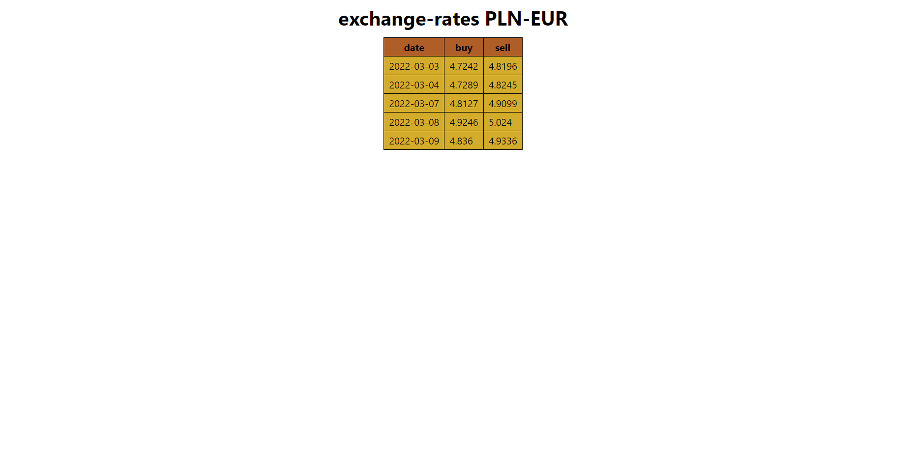
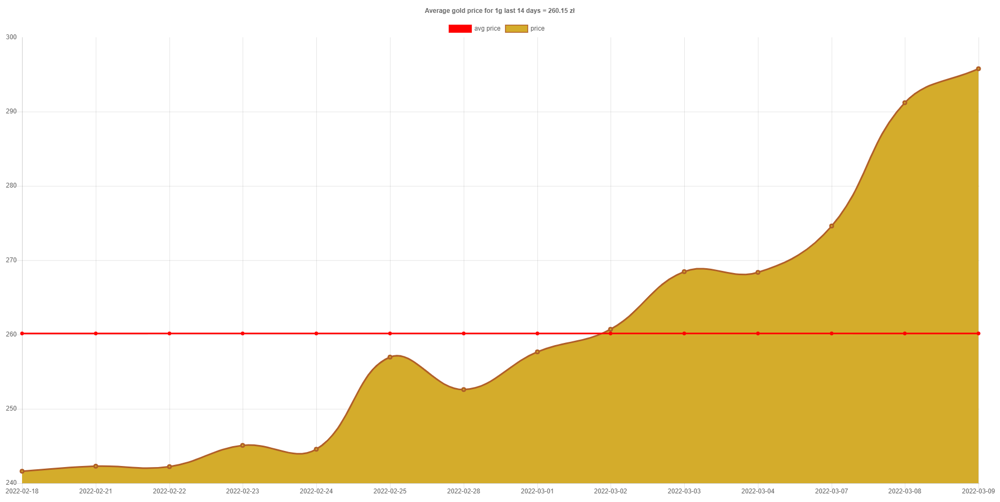

# Basic information

Spring boot application using NBP api. App has two endpoints:
* /api/exchange-rates/{currencyCode} which returns currency exchange rate PLN to {currencyCode} for the last business days. After using this endpoint html page with simple table is displayed.
Example for {currencyCode} = eur below:

* /api/gold-price/avarage which returns average gold price for the last 14 business days. After using this endpoint html page with chart showing how price has been changing for the last 14 business days and line which shows average price for 1g gold.
Chart was made with ChartJS framework.

#Technologies

* Html
* Css
* JavaScript
* ChartJS
* Java
* Spring boot
* Thymeleaf
